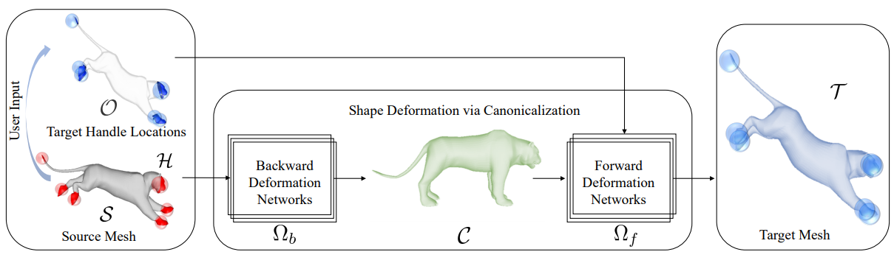
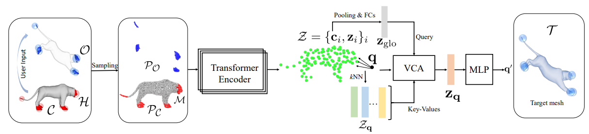

# NSDP

[**Paper**](https://arxiv.org/pdf/2210.05616.pdf) | [**arXiv**](https://arxiv.org/pdf/2210.05616.pdf)  | [**Video**](https://youtu.be/neKuf85H0nE) | [**Project Page**](https://tangjiapeng.github.io/projects/NSDP/) <br>

This is the repository that contains source code for the paper:

**Neual Shape Deformation Priors (NeurIPS 2022).**

For the task of shape manipulation, NSDP learns shape deformations via canonicalization :
<div style="text-align: center">

</div

We propose Transformer-based Deformation Networks （TDNets) for local deformation fields prediction :
<div style="text-align: center">

</div>


If you find NSDP useful for your work please cite:
```
@inproceedings{
    tang2022neural,
    title={Neural Shape Deformation Priors},
    author={Tang, Jiapeng and Markhasin Lev and Wang Bi and Thies Justus and Nie{\ss}ner, Matthias},
    booktitle={Advances in Neural Information Processing Systems},
    year={2022},
    }
```
Contact [Jiapeng Tang](mailto:jiapeng.tang@tum.de) for questions, comments and reporting bugs.